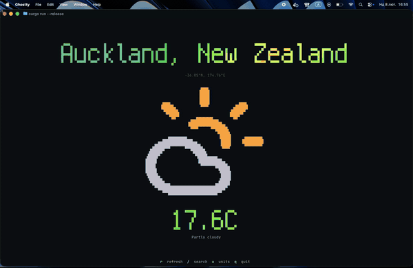

# artbox

ASCII art / FIGlet text that automatically scales to fit your terminal — with gradients, alignment, and a unified API for text, sprites, and images.



```
cargo add artbox
```

## Quick Start

```rust
use artbox::render;

let result = render("Hello", 40, 8)?;
println!("{}", result.to_plain_string());
```

Output:
```
 _   _      _ _
| | | | ___| | | ___
| |_| |/ _ \ | |/ _ \
|  _  |  __/ | | (_) |
|_| |_|\___|_|_|\___/
```

## Gradients

```rust
use artbox::{Renderer, Fill, LinearGradient, ColorStop, Color};

let renderer = Renderer::default()
    .with_fill(Fill::Linear(LinearGradient::new(
        45.0,
        vec![
            ColorStop::new(0.0, Color::rgb(255, 0, 128)),
            ColorStop::new(1.0, Color::rgb(0, 128, 255)),
        ],
    )));

let rendered = renderer.render("Hi", 20, 6)?;
print!("{}", rendered.to_ansi_string());
```

Supports solid colors, linear gradients (any angle), and radial gradients.

## Unified API

`Artbox` provides a single entrypoint for text, sprites, and images:

```rust
use artbox::{Artbox, Alignment, RenderTarget};

let art = Artbox::default().with_alignment(Alignment::Center);
let target = RenderTarget::new(80, 24);

let rendered = art.render_text("Hello", target)?;
print!("{}", rendered.to_ansi_string());
```

## Sprites

Multi-size layered ASCII sprites with per-layer gradient fills:

```rust
use artbox::{Sprite, Fill, Color};
use artbox::sprites::{SpriteLayer, SpriteVariant};

let layer = SpriteLayer::new("\\o/").with_fill(Fill::solid(Color::rgb(255, 200, 0)));
let variant = SpriteVariant::new("small", vec![layer]);
let sprite = Sprite::new(vec![variant]);

let rendered = sprite.render(40, 10)?;
print!("{}", rendered.to_ansi_string());
```

## Font Families

Built-in font families with size fallback:

```rust
use artbox::{Renderer, fonts};

// Blocky pixel style
let renderer = Renderer::new(fonts::family("blocky").unwrap());

// Available families: banner, blocky, script, slant
// Default stack: big -> standard -> small -> mini
```

Custom stacks:

```rust
let renderer = Renderer::new(fonts::stack(&["slant", "small_slant"]));
```

Load external fonts:

```rust
let font = Font::from_file("path/to/font.flf")?;
```

## Alignment

```rust
use artbox::{Renderer, Alignment};

let renderer = Renderer::default()
    .with_alignment(Alignment::Center)  // or TopLeft, BottomRight, etc.
    .with_letter_spacing(-1);           // negative = overlap
```

## Buffer Reuse

For hot paths, reuse the output buffer:

```rust
let mut buffer = String::new();
let metrics = renderer.render_into("Text", 40, 10, &mut buffer)?;
```

## Images

Enable the `images` feature for image-to-ASCII and terminal image protocols:

```toml
artbox = { version = "0.2", features = ["images"] }
```

```rust
use artbox::{Artbox, RenderTarget};

let art = Artbox::default();
let target = RenderTarget::new(80, 24);
let rendered = art.render_image_path("image.png", target)?;
print!("{}", rendered.to_ansi_string());
```

## ratatui Widget

Enable the `ratatui` feature:

```toml
artbox = { version = "0.2", features = ["ratatui"] }
```

```rust
use artbox::integrations::ratatui::{ArtBox, SpriteBox};

let widget = ArtBox::new(&renderer, "Hello");
frame.render_widget(widget, area);

let sprite_widget = SpriteBox::new(&sprite);
frame.render_widget(sprite_widget, area);
```

## Examples

```bash
# Text with gradient
cargo run --example gradient --features cli -- "Hello" 60 10 --gradient diagonal --from 255,0,128 --to 0,128,255

# Unified API (text + sprites)
cargo run --example artbox

# Sprite layers with per-layer gradients
cargo run --example sprite_gradients

# Image to ASCII (defaults to ruby.svg)
cargo run --example image --features images

# ratatui TUI
cargo run --example tui --features ratatui
```

## Docs

Hosted docs: https://dmk.github.io/artbox

Local docs:

```bash
cd docs
npm ci
npm run dev
```
